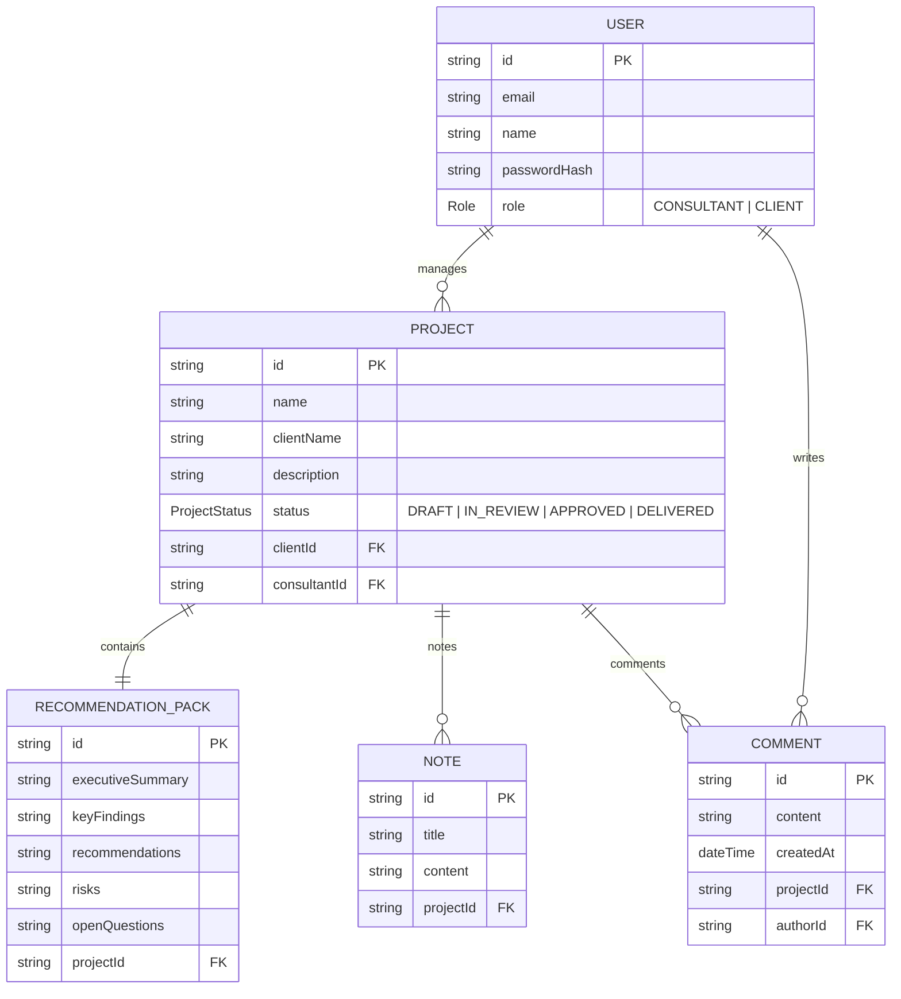

# Nile Project Manager

A modern, highly accessible consultant and client collaboration portal. Nile Project Manager streamlines the review and delivery process of project recommendations, notes, and feedback between consultants and clients.

## 🚀 Key Features

* **Role-Based Workflow State Machine**: Manages projects through distinct phases (`DRAFT` → `IN_REVIEW` → `APPROVED` → `DELIVERED`) with strict authorization rules.
* **Collaboration Thread**: Real-time comments on project reviews, showing author names and roles.
* **Restricted Consultant Notes**: Internal discovery notes visible exclusively to consultants.
* **Fully Accessible Design**: Strictly audited with Playwright and Axe-core to ensure zero WCAG 2.1 AA violations (including text contrast ratios $\ge$ 4.5:1, non-text element ratios $\ge$ 3.0:1, semantic `<article>` cards, and clear tab lists).
* **Dockerized Infrastructure**: Runs the React frontend, Express/TypeScript backend, and PostgreSQL database seamlessly via Docker Compose.
* **Automated CI/CD**: A GitHub Actions workflow running lint checks, unit/component tests, and E2E accessibility audits on pushes and pull requests to `main`.

---

## 🛠️ Technology Stack

| Layer | Technologies |
|---|---|
| **Frontend** | React, Vite, TypeScript, Panda CSS (Styled System), Park UI (Ark UI base) |
| **Backend** | Node.js, Express, TypeScript, JWT (Auth/RBAC) |
| **Database** | PostgreSQL, Prisma ORM |
| **Testing** | Jest & Supertest (Backend), Vitest & RTL (Frontend), Playwright & Axe-core (E2E/A11y) |
| **DevOps** | Docker, Docker Compose, GitHub Actions |

---

## 🏗️ Database Architecture & State Machine

The database is powered by Prisma and PostgreSQL. The relational schema is structured as follows:



### State Transition Workflow Rules:
1. **`DRAFT` (Consultant Only)**: Initial state. Only visible to the consultant.
2. **`IN_REVIEW` (Client & Consultant)**: Consultant submits the draft. The client can view the recommendation pack and post comments.
3. **`APPROVED` (Client & Consultant)**: Client approves the project recommendation.
4. **`DELIVERED` (Client & Consultant)**: Consultant marks the approved project as delivered.

---

## 💻 Getting Started

### Prerequisites
* [Node.js](https://nodejs.org/) (v20+)
* [Docker](https://www.docker.com/) & Docker Compose

### 1. Setup Environment
Initialize the local configuration in the backend:
```bash
cp backend/.env.example backend/.env
```

### 2. Start Services (Docker Compose)
Build and spin up the backend API, frontend dev server, and PostgreSQL database:
```bash
docker compose up -d --build
```
This will automatically push the schema and seed the database with mock consultant and client users.

* **Frontend Dashboard**: [http://localhost:5173](http://localhost:5173)
* **Backend API Gateway**: [http://localhost:5001](http://localhost:5001)

### 3. Seed / Reset Database
To manually wipe and seed the database to the clean initial state (works locally or in CI):
```bash
# Inside active Docker container:
docker compose exec -T backend npm run db:seed -w backend

# Or locally (if PostgreSQL port 5432 is exposed to host):
npm run db:seed -w backend
```

---

## 🧪 Testing Suites

Run unit, integration, and E2E test suites:

### Backend Tests (Jest + Supertest)
Runs 23 integration and API route mock assertions in isolation:
```bash
npm test -w backend
```

### Frontend Tests (Vitest + React Testing Library)
Runs component and authentication tests:
```bash
npm test -w frontend
```

### End-to-End & Accessibility Tests (Playwright + Axe-core)
Exercises the full consultant-to-client pipeline and performs strict WCAG 2.1 AA accessibility scans:
```bash
# Ensure services are running first (docker compose up -d)
npm run test:e2e
```
*Playwright will automatically execute `docker compose exec` to seed a clean database state before running the E2E assertions.*

---

## 👷 CI/CD Workflow Triggering

We use GitHub Actions to enforce code quality and prevent regression:
* **Trigger Policy**: CI runs automatically on any pull request targeting `main` and on merges/pushes to `main`. Triggering is optimized to avoid duplicate runs on feature branches.
* **Pipeline Jobs**:
  1. **Linting**: Lints the entire codebase (`npm run lint`).
  2. **Backend Unit/Integration Tests**: Runs mock Jest route checks.
  3. **Frontend Component Tests**: Runs component tests in a headless environment.
  4. **E2E & A11y Tests**: Sets up Docker Compose services, waits for HTTP readiness, installs Playwright dependencies, executes E2E workflow accessibility checks, and uploads reports as workflow artifacts.
